# Hi, I'm Brian!

I help people build and operate scalable, resilient IT infrastructures.

- 🔭 I’m currently working on [The Azure Cloud Resume Challenge](https://www.bcbrookman.com/posts/taking-on-the-azure-cloud-resume-challenge/)
- 🌱 I’m currently studying for the [Azure Administrator Associate (AZ-104)](https://learn.microsoft.com/en-us/credentials/certifications/azure-administrator/) exam
- 📖 I'm currently reading [these books](https://www.goodreads.com/review/list/172255177?shelf=currently-reading)
- 📝 I write stuff regularly at [www.bcbrookman.com](https://www.bcbrookman.com)
- 🔗 Connect with me on [my other profiles](https://profiles.bcbrookman.com)
- 💬 Ask me about **networking, cloud, or Kubernetes!**
- ⚡ Fun fact: **I ❤️ 🐈s**

## Updates from my website

<!-- BLOG-POST-LIST:START -->
- [Taking on the Azure Cloud Resume Challenge](https://www.bcbrookman.com/posts/taking-on-the-azure-cloud-resume-challenge/)
- [Updating Container Images the Flux GitOps way](https://www.bcbrookman.com/posts/updating-container-images-the-flux-gitops-way/)
- [Exploring Kubernetes Service Networking](https://www.bcbrookman.com/posts/exploring-kubernetes-service-networking/)
- [What Even is a Link State Anyways](https://www.bcbrookman.com/posts/what-even-is-a-link-state-anyways/)
- [Trying out Harvester HCI in my Homelab](https://www.bcbrookman.com/posts/trying-out-harvester-hci-in-my-homelab/)
<!-- BLOG-POST-LIST:END -->

---

  

